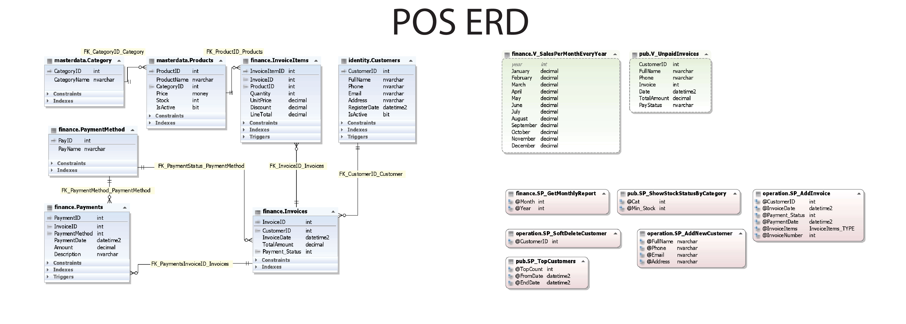

# POS

The POS (Point of Sale) project is a SQL Server–based software system designed to manage sales, customer, and payment processes. It consists of several specialized tables and schemas, storing and processing all information related to products, categories, customers, invoices, and financial transactions in a well-structured manner. The optimized schema of tables and objects enables clear separation and organization of data based on business logic areas, customer identity, and financial operations.

This project is built to demonstrate advanced skills in database design and implementation, featuring a collection of optimized and practical Stored Procedures for supporting application-layer operations, intelligent Triggers for event monitoring and automated data management, and analytical and aggregate Views for simplifying reporting and data analysis. In addition, Table-Valued Functions (TVFs) have been created for specialized reporting, and User-Defined Types (UDTs) have been implemented to provide reusable data structures across the system.

To enhance organization and scalability, a well-structured schema design has been implemented along with Synonyms to facilitate cross-schema object referencing. The ultimate goal of this project is to provide a comprehensive, scalable, and production-ready database model that seamlessly addresses both operational requirements and reporting/analytical needs in a unified solution.

## Key Highlights & Project Objectives

- Stored Procedure
- Trigger
- TVF
- View
- Aggregation Functions
- Table Relations
- Cursor
- Manage Transaction (Try/catch | xact_abort)
- UDT
- Synonym
- Schema
- File Group
- ...

## Other Important Things

⚡️ All Data in DB Generated By "Redgate SQL Data Generator 4"

⚡️ Using "dbforge SQL Decryptor" For Decrypt All SP

⚡️ Document Created By "Redgate SQL Doc 5"

## ERD

## Feedback

If you have any feedback, please reach out to us at 
https://rezaferdosara.ir/

